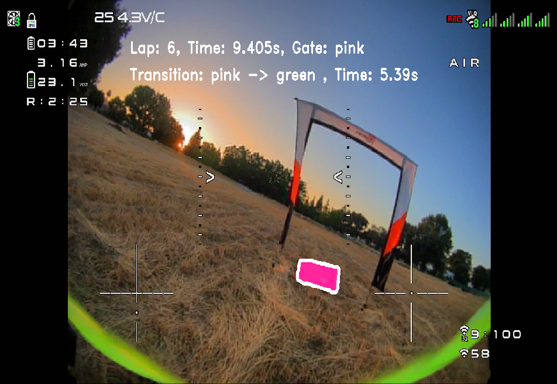
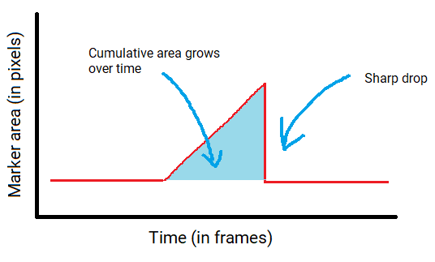

## HDZero Lap Timer

This project uses HDZero goggles DVR (either live, or pre-recorded) to count laps around a racetrack.

## How Does it Work

Under the hood, the software uses basic computer vision algorithms (thresholding, masking, etc.) to detect when a drone goes through a gate.

This is done by using a large uniform color marker that the software can easily detect.

  

The size and color are of the marker are very important. You have to pick a color that is unlikely to show 
in other places throughout the track. Also, the marker size must be big enough so that it's not confused with image noise.

The position of the marker is also important. You have to place the marker in a location where it will be seen by the pilots camera when flying at high speed.

## Peak Detection

How does it know that you have gone "through" a gate? It actually does not !

The peak detection algorithm treats the detected marker area as if it was signal value over time. In other words, whenever the marker is in view, and detected, its area 
is the signal value at that time. With this approach, you can infer some crucial information about the drone flight. 

First, you can tell whether the drone is moving toward or away from the marker. If moving toward the marker, 
the area gets bigger over time. If moving away from the marker the area gets smaller over time. 

Second, you can tell how close to the marker the drone is. The larger the area, the closer the drone is to the marker.

When the software detects that the drone is moving toward a marker, it sums all the detected areas and accumulates them over time.
Then, when the marker goes out of view for multiple consecutive frames, the cumulative area stops increasing very abruptly.

At this point the software treats this event as a "Peak" and assumes the drone has gone through the gate.

  

There are some situations where a "Peak" is detected, but the drone has not actually gone through the gate.
This can happen if the drone flies by near or over the gate without actually going through. These are what I call "False Peaks".

You can tune the configuration parameters so that false peaks are filtered out and ignored.

### Peak Detection Tuning

The following parameters can be tuned per-gate to make accurate and valid peak detections.

  * **minMillisBetweenActivations**   
    This is the minimum amount of time that is allowed for two consecutive detections of the same marker.
    This is useful in cases where you know more or less the expected time a lap takes, so you set this value
    to be slighter lower than the fastest lap.

  * **minActivationValue**  (cumulative area in pixels)  
    This is the minimum cumulative area that is required for a valid Peak. This is useful in cases where the drone
    might do a U-turn after going through a gate, and the marker is briefly visible. In this case, you can set this parameter
    to a value high enough so that the smaller peaks are ignored.

    
  * **minActivationFrames** (time in frames)  
    This is how wide the peak must be so that it's considered valid. In other words, this represents how many frames the marker 
    must be visible as the drone flies toward it. The value you set this to depends on how fast the drones are. 
    For very fast drones, the marker might only be visible for a few frames.

  * **minInactivationFrames** (time in frames)  
    This is how many consecutive frames the marker must **not** be visible for a peak to be detected.

